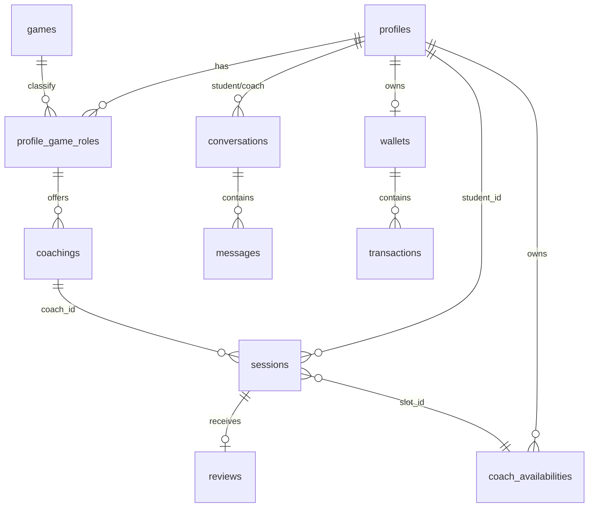
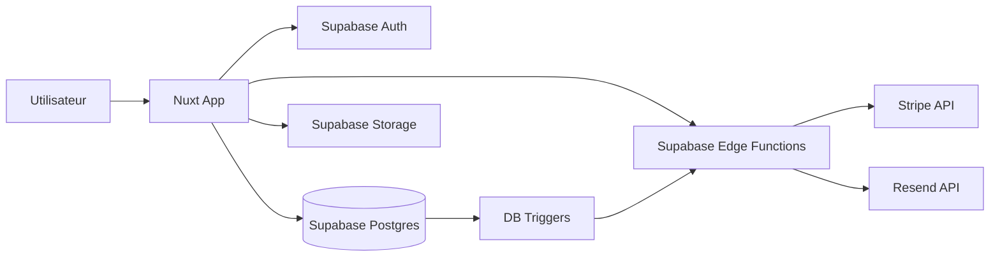
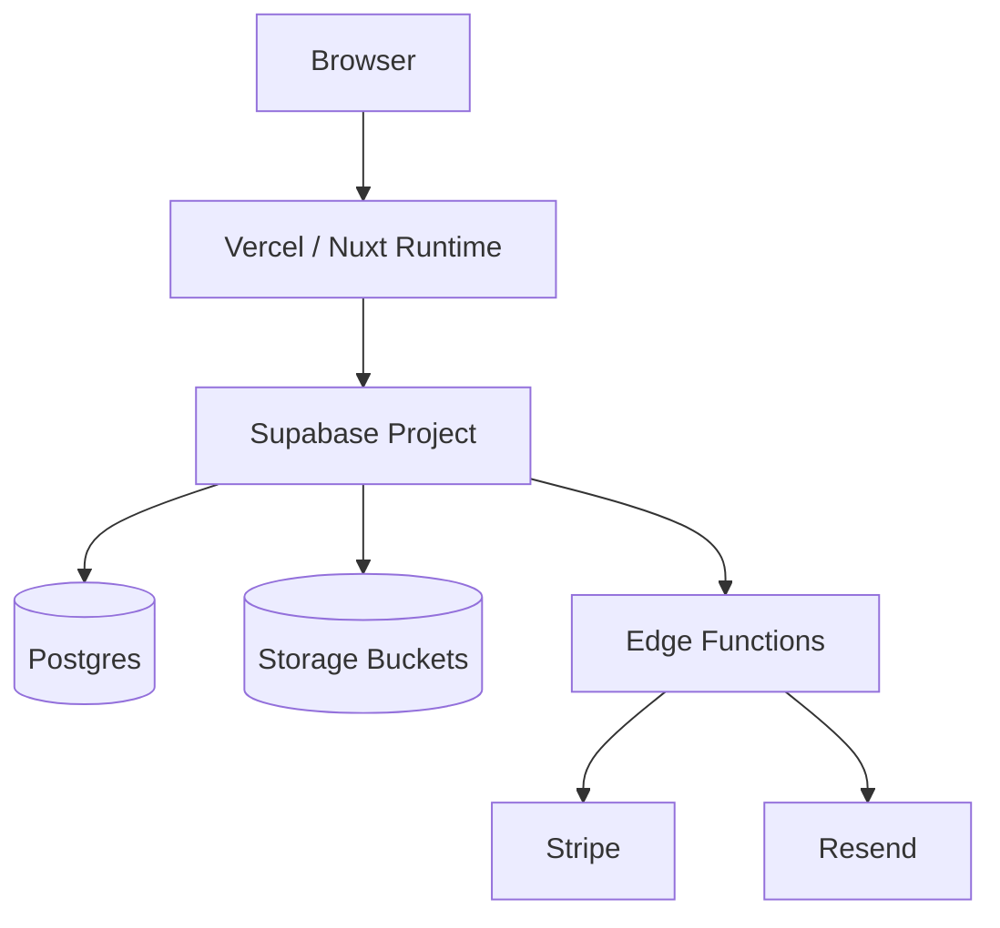

# CoachMe

CoachMe est une plateforme SaaS de coaching gaming qui met en relation des eleves et des coachs verifies, avec reservation de creneaux, paiement Stripe, suivi de transactions et systeme d'emails transactionnels.

Reference repository: [bisounours1111/coach-me](https://github.com/bisounours1111/coach-me)

## 1) Concept du projet

- **Probleme**: difficulte a trouver des coachs fiables et specialises par jeu/rang.
- **Solution**: marketplace verticale avec profils, offres de coaching, disponibilites, messagerie, paiement et suivi.
- **Cible**: joueurs competitifs (amateur a semi-pro), coachs/creators souhaitant monetiser leur expertise.
- **Monetisation**: commissions sur sessions payantes via Stripe.

## 2) Contraintes techniques

- **Frontend**: Nuxt 4 + Vue 3.
- **Backend / BDD**: Supabase (PostgreSQL, Auth, Storage, RLS, Edge Functions).
- **Paiement**: Stripe Checkout + Stripe Connect.
- **Email transactionnel**: Resend via Edge Function `send-session-emails`.
- **Securite data**: RLS active sur les tables metier.

## 3) Fonctionnalites principales

- **Authentification**: inscription, connexion, reset password.
- **Profils**: fiche publique, informations coach, jeux/rangs, medias.
- **Offres de coaching**: modeles par jeu, tarif horaire, activation/desactivation.
- **Disponibilites**: gestion des slots coach et statuts de reservation.
- **Reservation**: creation de session, negotiation/prix, statut lifecycle.
- **Paiement**: checkout Stripe, suivi paiement, wallet/transactions.
- **Messagerie**: conversation eleve-coach + historique messages + realtime.
- **Emails**: notifications de statuts et actions de session (confirm/annuler).

## 4) UML (modele de donnees simplifie)



## 5) Diagramme d'architecture applicative



## 6) Diagramme d'infrastructure



## 7) Livrables

- Application web Nuxt fonctionnelle.
- Schema SQL consolidé dans `supabase/migrations/000_full_schema.sql`.
- Fonctions Edge pour checkout, paiements, payouts, emails, session actions.
- Documentation technique dans `docs/` et `supabase/README.md`.

## 8) Guide d'installation complet (local)

### 8.1 Prerequis

- Node.js 20+ (recommande: LTS recente)
- npm 10+
- Un projet Supabase actif
- Un compte Stripe (cles test)
- Un compte Resend (cle API + domaine expediteur verifie)

### 8.2 Cloner et installer

```bash
git clone https://github.com/bisounours1111/coach-me.git
cd coach-me
npm install
```

### 8.3 Variables d'environnement Nuxt (`.env` a la racine)

Creer un fichier `.env` a la racine avec:

```env
SUPABASE_URL=https://<project-ref>.supabase.co
SUPABASE_ANON_KEY=<anon-key>
SUPABASE_SECRET_KEY=<service-role-key-ou-secret>
SUPABASE_DB_URL=postgresql://postgres:<password>@db.<project-ref>.supabase.co:5432/postgres
CLIENT_URL=http://localhost:3000

STRIPE_SECRET_KEY=<stripe-secret-key>
RESEND_API_KEY=<resend-api-key>
EMAIL_FROM=Coach-me <no-reply@votre-domaine.com>
EMAIL_WEBHOOK_SECRET=<secret-partage>
SESSION_ACTION_SECRET=<meme-valeur-que-EMAIL_WEBHOOK_SECRET>
PUBLIC_APP_URL=http://localhost:3000
```

Notes:
- `SUPABASE_SECRET_KEY` est utilise par le module Nuxt Supabase (`nuxt.config.ts`) et certaines fonctions Edge attendent `SUPABASE_SERVICE_ROLE_KEY` (ou fallback `SUPABASE_SECRET_KEY`).
- Pour la coherence, renseigner aussi `SUPABASE_SERVICE_ROLE_KEY` dans les secrets Edge (voir section suivante).

### 8.4 Secrets Supabase Edge Functions

Configurer dans **Supabase Dashboard -> Project Settings -> Edge Functions -> Secrets**:

- `SUPABASE_URL`
- `SUPABASE_SERVICE_ROLE_KEY`
- `STRIPE_SECRET_KEY`
- `RESEND_API_KEY`
- `EMAIL_FROM`
- `EMAIL_WEBHOOK_SECRET`
- `SESSION_ACTION_SECRET` (meme valeur que `EMAIL_WEBHOOK_SECRET`)
- `CLIENT_URL` (ou `PUBLIC_APP_URL`)

### 8.5 Base de donnees Supabase

Le projet utilise un fichier SQL unique:

- `supabase/migrations/000_full_schema.sql`

Execution:
1. Ouvrir Supabase SQL Editor.
2. Coller/executer tout le contenu de `000_full_schema.sql`.
3. Verifier ensuite:
   - tables metier (`profiles`, `games`, `profile_game_roles`, `coachings`, `sessions`, `reviews`, etc.)
   - tables paiement (`wallets`, `transactions`)
   - messagerie (`conversations`, `messages`)
   - email (`email_events`, `session_action_tokens`)
   - buckets (`coach-videos`, `avatars`, `rank`, `game-icons`)

### 8.6 Configuration Auth Supabase (obligatoire)

Dans **Authentication -> URL Configuration**:

- **Site URL**:
  - local: `http://localhost:3000`
  - prod: URL de deploiement (ex: `https://coach-me-nine.vercel.app`)
- **Redirect URLs**:
  - `http://localhost:3000/auth/reset`
  - `<url-prod>/auth/reset`

### 8.7 Lancer le projet

```bash
npm run dev
```

Application locale: `http://localhost:3000`

### 8.8 Build / preview

```bash
npm run build
npm run preview
```

## 9) Structure des dossiers Nuxt

- `app/components`: composants UI reutilisables (cards, formulaires, widgets, etc.).
- `app/composables`: logique metier reactive partagee (`useAuth`, `useSessions`, `useMessaging`, etc.).
- `app/layouts`: structures globales de pages (`default`, `auth`).
- `app/pages`: routes Nuxt file-based (auth, dashboard, profile, booking, etc.).
- `app/middleware`: guards de navigation (auth, role, onboarding, coach-only).
- `app/plugins`: plugins Vue/Nuxt (ex: `v-calendar`).
- `app/types`: typages TypeScript metier.
- `app/utils`: utilitaires transverses (navigation, validation, etc.).
- `app/assets`: styles et ressources statiques transformees au build.
- `public`: assets statiques servis tels quels.
- `supabase`: migrations SQL + Edge Functions.
- `docs`: documentation technique et guides complementaires.

## 10) Commandes utiles

| Commande | Description |
|---|---|
| `npm run dev` | Demarrage en developpement |
| `npm run build` | Build production |
| `npm run preview` | Preview du build |
| `npm run generate` | Generation statique |

